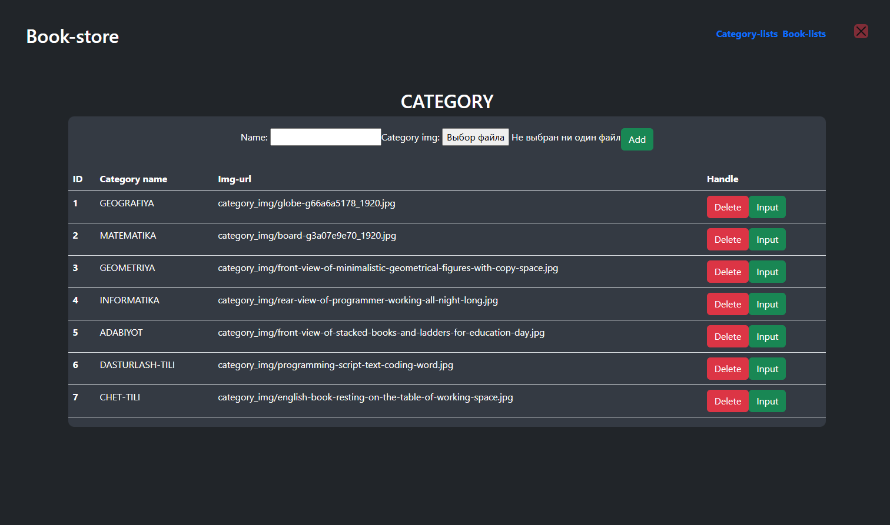

# 📚 Book-store 2.0

Веб-приложение на **Django** для управления и поиска книг.  
Проект создан как прототип онлайн-книжного магазина / каталога.

---

## 🗂️ Структура проекта
Book-store2.0/
├── book/ # Основное Django-приложение (модели, views, admin)
├── config/ # Конфигурация проекта (settings, urls, wsgi)
├── media/ # Загруженные изображения и файлы
├── whoosh_index/ # Индекс Whoosh (поиск по книгам)
├── manage.py # Утилита управления Django
├── requirements.txt # Python-зависимости
├── server.py # Запуск проекта (например, для Heroku)
├── Procfile # Настройка для деплоя
└── db.sqlite3 # Локальная база данных

---

## ⚙️ Технологии
- Python 3.10+
- Django 4.x
- SQLite
- JavaScript
- HTML/CSS
- Bootstrap
- Whoosh (поиск)
- Heroku (через Procfile)

---

## 🚀 Установка и запуск

1. **Клонировать репозиторий**  
   ```bash
   git clone https://github.com/1DARKWEB1/Book-store2.0.git
   cd Book-store2.0

2. Создать и активировать виртуальное окружение
   python -m venv venv
   venv\Scripts\activate       # Windows
   source venv/bin/activate    # macOS / Linux

3.Установить зависимости
   pip install -r requirements.txt
   Запустить сервер разработки
   python manage.py runserver
👉 Перейти в браузере: http://127.0.0.1:8000/

📌 Возможности
   👩‍💼 Админ-панель для управления книгами
   🔍 Поиск по книгам через Whoosh
   📂 Загрузка и хранение изображений обложек в media/
   ⚡ Простая настройка деплоя (Heroku / server.py)

## 🖼️ Интерфейс приложения
## Главная страница


## Cтраница поиска


## Страница админа


👤 Автор
Разработчик: Jasur
